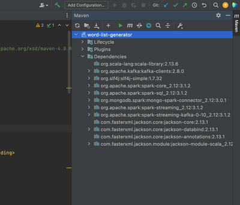
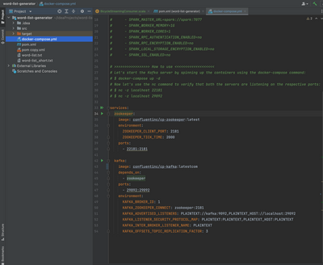

### Sample:  _word-list-generator.zip_
### 1. Tạo chương trình Maven (Scala)
* Tại màn hình Welcome, click “Create New Project”.
    [](https://codingpearls.com/wp-content/uploads/2017/01/new-project.png)
* Ở cửa sổ New Project, chọn Maven (bỏ chọn Create from archetype) rồi click Next.
    [](https://codingpearls.com/wp-content/uploads/2017/01/new-project-2.png)
**GroupId**: Các bạn nhập gì cũng được, không cần giống như ví dụ
**ArtifactId**: word-list-generator

* Sau đó click Next.
    [](https://codingpearls.com/wp-content/uploads/2017/01/new-project-3.png)
* Nhập tên Project là WordListGeneratorProducer
* Sau đó chọn đường dẫn để lưu project. Click Finish.

### 2. Config chương trình để chạy Scala:
Sau khi Intellij IDEA nó load Project mới xong,các bạn expand cái thư mục **src** ra, sau đó lần lược right click vào thư mục **main** và **test**, chọn **New -> Directory**, đặt tên là **scala**
    [](https://codingpearls.com/wp-content/uploads/2017/01/create-scala-folder.png)

Sau đó, chọn cái thư mục** main/scala** này, right click, chọn **“Mark Directory as” -> Source Root**
    [](https://codingpearls.com/wp-content/uploads/2017/01/main-source-root.png)

Làm tương tự cho thư mục **test/scala**, right click, chọn **“Mark Directory as” -> Test Source Root**
    [](https://codingpearls.com/wp-content/uploads/2017/01/test-source-root.png)

Các bạn mở cái file **pom.xml** ra, đổi nội dung như sau:
```
<?xml version="1.0" encoding="UTF-8"?>
<project xmlns="http://maven.apache.org/POM/4.0.0"
         xmlns:xsi="http://www.w3.org/2001/XMLSchema-instance"
         xsi:schemaLocation="http://maven.apache.org/POM/4.0.0 http://maven.apache.org/xsd/maven-4.0.0.xsd">
    <modelVersion>4.0.0</modelVersion>

    <groupId>com.vincentle.kafka.training</groupId>
    <artifactId>word-list-generator</artifactId>
    <packaging>jar</packaging>
    <version>1.0</version>

    <name>Kafka Custom Producer</name>
    <url>https://www.codingpearls.com</url>

    <properties>
        <project.build.sourceEncoding>UTF-8</project.build.sourceEncoding>
        <project.reporting.outputEncoding>UTF-8</project.reporting.outputEncoding>

        <scala.version>2.10.6</scala.version>
        <scala.built.version>2.10</scala.built.version>
        <kafka.version>0.10.1.1</kafka.version>
        <slf4j.version>1.7.21</slf4j.version>

    </properties>

    <dependencies>
        <!-- scala -->
        <dependency>
            <groupId>org.scala-lang</groupId>
            <artifactId>scala-library</artifactId>
            <version>${scala.version}</version>
        </dependency>

        <!-- https://mvnrepository.com/artifact/org.apache.kafka/kafka-clients -->
        <dependency>
            <groupId>org.apache.kafka</groupId>
            <artifactId>kafka-clients</artifactId>
            <version>${kafka.version}</version>
        </dependency>

        <!-- https://mvnrepository.com/artifact/org.slf4j/slf4j-simple -->
        <dependency>
            <groupId>org.slf4j</groupId>
            <artifactId>slf4j-simple</artifactId>
            <version>${slf4j.version}</version>
        </dependency>


    </dependencies>

    <build>
        <defaultGoal>install</defaultGoal>
        <sourceDirectory>src/main/scala</sourceDirectory>
        <testSourceDirectory>src/test/scala</testSourceDirectory>

        <plugins>
            <!--Maven plugins-->
            <plugin>
                <groupId>org.apache.maven.plugins</groupId>
                <artifactId>maven-jar-plugin</artifactId>
                <version>3.0.2</version>
                <configuration>
                    <outputDirectory>${basedir}/dist</outputDirectory>
                    <archive>
                        <manifest>
                            <addClasspath>true</addClasspath>
                            <classpathPrefix>lib/</classpathPrefix>
                            <mainClass>com.vincentle.kafka.training.WordListGeneratorProducer</mainClass>
                        </manifest>
                    </archive>
                </configuration>
            </plugin>


            <!-- https://mvnrepository.com/artifact/org.apache.maven.plugins/maven-dependency-plugin -->
            <!-- copy project jar & lib to dist -->
            <plugin>
                <groupId>org.apache.maven.plugins</groupId>
                <artifactId>maven-dependency-plugin</artifactId>
                <version>2.10</version>
                <executions>
                    <execution>
                        <id>copy-dependencies</id>
                        <phase>package</phase>
                        <goals>
                            <goal>copy-dependencies</goal>
                        </goals>
                        <configuration>
                            <includeScope>runtime</includeScope>
                            <outputDirectory>${basedir}/dist/lib/</outputDirectory>
                        </configuration>
                    </execution>
                </executions>
            </plugin>

            <!-- the Maven compiler plugin will compile Java source files -->
            <plugin>
                <groupId>org.apache.maven.plugins</groupId>
                <artifactId>maven-compiler-plugin</artifactId>
                <version>3.5.1</version>
                <configuration>
                    <source>1.8</source>
                    <target>1.8</target>
                </configuration>
            </plugin>

            <plugin>
                <groupId>org.apache.maven.plugins</groupId>
                <artifactId>maven-resources-plugin</artifactId>
                <version>3.0.1</version>
                <configuration>
                    <encoding>UTF-8</encoding>
                </configuration>
            </plugin>

            <!-- the Maven Scala plugin will compile Scala source files -->
            <plugin>
                <groupId>net.alchim31.maven</groupId>
                <artifactId>scala-maven-plugin</artifactId>
                <version>3.2.2</version>
                <executions>
                    <execution>
                        <goals>
                            <goal>compile</goal>
                            <goal>testCompile</goal>
                        </goals>
                    </execution>
                </executions>
            </plugin>

        </plugins>
    </build>

</project>

```

* Sau đó click “Import Changes” ở góc phải dưới của Intellij IDEA để nó cập nhật các dependencies
    

* Tiếp theo, right click vào thư mục **src/main/scala** chọn **New ->Package** để tạo một package là **com.vincentle.kafka.training**. 
* Sau đó right click vào package này, chọn **New -> Scala Class**, chọn mục object và nhập tên object tên là **WordListGeneratorProducer**.
```scala
package com.vincentle.kafka.training

/**
  * Created by vincent on 1/14/2017.
  */

import java.util.Properties

import org.apache.kafka.clients.producer.{KafkaProducer, ProducerRecord}

import scala.collection.mutable.ListBuffer
import scala.io.Source
import scala.util.Random

object WordListGeneratorProducer {
  def main(args: Array[String]): Unit = {

    //Get the Kafka broker node
    val brokers = util.Try(args(0)).getOrElse("localhost:9092")

    //Get the exists topic named welcome-message
    val topic = util.Try(args(1)).getOrElse("welcome-message")

    val events = util.Try(args(2)).getOrElse("100").toInt

    val intervalEvent = util.Try(args(3)).getOrElse("1").toInt //in second

    val filePath = util.Try(args(4)).getOrElse("E:\\temp\\data\\word-list.txt")

    val clientId = "kafka-custom-producer"

    //Create some properties
    val props = new Properties()
    props.put("bootstrap.servers", brokers)
    props.put("client.id", clientId)
    props.put("key.serializer", "org.apache.kafka.common.serialization.StringSerializer")
    props.put("value.serializer", "org.apache.kafka.common.serialization.StringSerializer")

    val producer = new KafkaProducer[String, String](props)

    val wordList = Source.fromFile(filePath).getLines().toSeq

    println("======================BEGIN=============================")

    val beforeTime = System.currentTimeMillis()
    for(i <- Range(0, events)){
      val rndWords = getRandomWordList(wordList)
      val key = i.toString()
      val value = rndWords.mkString(",")
      val data = new ProducerRecord[String, String](topic, key, value)

      println(data)
      producer.send(data)

      if(intervalEvent > 0)
        Thread.sleep(intervalEvent * 1000)
    }
    val afterTime = System.currentTimeMillis()

    println("======================END=============================")
    println("Total time: " + ((afterTime - beforeTime) / 1000) + " sec")
    producer.close()
  }

  def getRandomWordList(words: Seq[String]): Seq[String] ={

    var rdnWords = new ListBuffer[String]()
    val rnd = new Random()

    for(i <- 0 until 10){
      rdnWords += words(rnd.nextInt(words.length))
    }

    rdnWords
  }
}
```
* Dùng maven để build ra file jar. các bạn chọn menu **View -> Tool Windows -> Maven Projects**, ở của sổ này, các bạn chọn **Lifecycle**, double click **package** để build file jar.
    
    
 * Sau khi build file **jar** thành công, file **word-list-generator-1.0.jar** của sẽ nằm ở thư mục: **PROJECT_DIR\dist** 
 * Dùng lệnh **java** với tham số **-cp** để chạy file jar này.
 * Cách chạy file jar
 ```bash
# Di chuyển vào thư mục dist từ Terminal
# Chạy lệnh sau từ Terminal
java -cp word-list-generator-1.0.jar com.vincentle.kafka.training.WordListGeneratorProducer localhost:9092 welcome-message 20 5 ./word-list.txt

# brokers: localhost:9092 đây là port mà kafka sử dụng để lắng nghe dữ liệu.
# topic: welcome-message đây là một topic của kafka mà ta muốn đưa dữ liệu vào.
# events: 20 đây là số lần mong muốn chạy.
# intervalEvent: 5 seconds đây là thời gian delay của mỗi lần gửi dữ liệu.
# filePath: word-list.txt là một file đã được tạo sẵn, có thể tạo bất cứ thứ gì mình muốn.
```
###  Chạy kafka để hứng dữ liệu
* Chương trình trên đang chạy để đưa dữ liệu vào kafka, ta cần start kafka để hứng dữ liệu này.
* Kafka cần config host để hứng dữ liệu tại port 9092
* Để start kafka ta sử dụng docker thay vì setup một cách thủ công
```yyaml
docker-compose up -d
```
    

###  Hướng dẫn config file pom
1. Nơi tìm các thirdparty để sử dụng
    * https://mvnrepository.com/
    * https://search.maven.org/
2. Cấu trúc và giải thích
<project>
    <!-- Nơi config thông tin project -->
    <!-- Nơi config các properties chung của project -->
    <!-- Nơi config các thư viện ta cần sử dụng -->
        <!-- Thông tin các thư viện tìm tại mục 1 -->
    <!-- Nơi config các thông tin cho việc build project -->
</project>

```Chi tiết
<?xml version="1.0" encoding="UTF-8"?>
<project xmlns="http://maven.apache.org/POM/4.0.0"
         xmlns:xsi="http://www.w3.org/2001/XMLSchema-instance"
         xsi:schemaLocation="http://maven.apache.org/POM/4.0.0 http://maven.apache.org/xsd/maven-4.0.0.xsd">
    
<!-- Nơi config thông tin project -->
    <name>Kafka Custom Producer</name>
    <version>1.0</version>
    <modelVersion>4.0.0</modelVersion>
    <groupId>com.vincentle.kafka.training</groupId>
    <artifactId>word-list-generator</artifactId>
    <packaging>jar</packaging>
    <url>https://www.codingpearls.com</url>

<!-- Nơi config các properties chung của project -->
    <properties>
        <project.build.sourceEncoding>UTF-8</project.build.sourceEncoding>
        <project.reporting.outputEncoding>UTF-8</project.reporting.outputEncoding>

        <scala.version>2.10.6</scala.version>
        <scala.built.version>2.10</scala.built.version>
        <kafka.version>0.10.1.1</kafka.version>
        <slf4j.version>1.7.21</slf4j.version>
    </properties>

<!-- Nơi config các thư viện ta cần sử dụng -->
<!-- Thông tin các thư viện tìm tại mục 1 -->
    <dependencies>
        <!-- scala -->
        <dependency>
            <groupId>org.scala-lang</groupId>
            <artifactId>scala-library</artifactId>
            <version>${scala.version}</version>
        </dependency>

        <!-- https://mvnrepository.com/artifact/org.apache.kafka/kafka-clients -->
        <dependency>
            <groupId>org.apache.kafka</groupId>
            <artifactId>kafka-clients</artifactId>
            <version>${kafka.version}</version>
        </dependency>

        <!-- https://mvnrepository.com/artifact/org.slf4j/slf4j-simple -->
        <dependency>
            <groupId>org.slf4j</groupId>
            <artifactId>slf4j-simple</artifactId>
            <version>${slf4j.version}</version>
        </dependency>
    </dependencies>

<!-- Nơi config các thông tin cho việc build project -->
    <build>
        <defaultGoal>install</defaultGoal>
        <sourceDirectory>src/main/scala</sourceDirectory>
        <testSourceDirectory>src/test/scala</testSourceDirectory>

        <plugins>
            <!--Maven plugins-->
            <!-- https://mvnrepository.com/artifact/org.apache.maven.plugins/maven-dependency-plugin -->
            <!-- copy project jar & lib to dist -->
            <!-- the Maven compiler plugin will compile Java source files -->
            <!-- the Maven Scala plugin will compile Scala source files -->
        </plugins>
    </build>

</project>

```
4. 

### . Tạo chương trình Maven (Scala):

