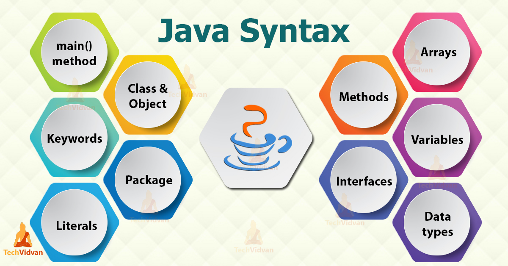
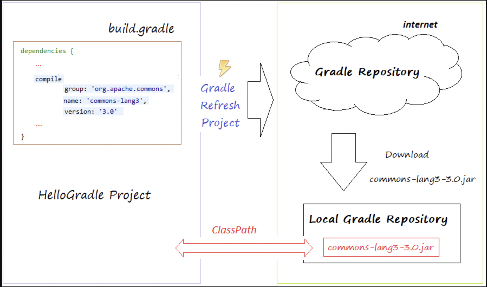
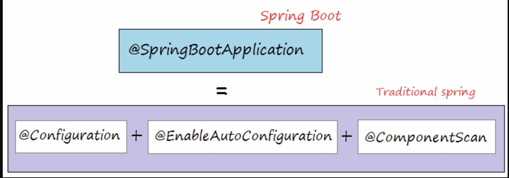
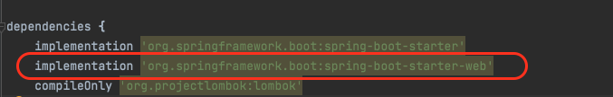
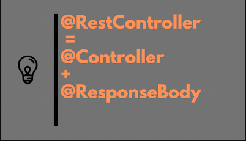

# Kiến thức về Java + SpringBoot

**SpringBoot** là một Framework được phát triển bằng ***Java\*** hoặc ***Kotlin\*** giúp ta tạo nhanh **Web App** mà không cần phải lo đến các thiết lặp phức tạp. Bằng cách sử dụng kỹ thuật **Dependency Injection (DI)**, **SpringBoot** giúp mô hình trở nên linh hoạt hơn bởi tính chất không ràng buộc. **Thuật ngữ: Loosely coupled applications (tigt-coupling ---> loosely coupled)**.



 Java Cheat Sheet, M. Hamedani

[Nguồn tham khảo](https://www.edureka.co/blog/java-collections/)

Mô tả: Tập các syntax trong Java từ Basic đến Advance

 Java Programming Cheatsheet, Princeton University

[Nguồn tham khảo](https://introcs.cs.princeton.edu/java/11cheatsheet/)

Mô tả: Kiến trúc ngôn ngữ Java

 All Spring Anotations Cheatsheet, JRebel by [Perforce](https://www.perforce.com/) © 2021 Perforce Software, Inc.

[Nguồn tham khảo](https://www.jrebel.com/blog/spring-annotations-cheat-sheet)

Mô tả: Tổng hợp Anotation và kiến trúc SpringBoot

## 1. Sự hoạt động các biến môi trường

## 2. Quản lý thư viện bằng Gradle

Hướng dẫn sử dụng: [Link](https://www.jetbrains.com/idea/guide/tutorials/working-with-gradle/gradle-dependencies/)



## 3. Sử dụng thêm thư viện

Nơi quán lý thư viện: https://mvnrepository.com/tags/gradle

Sử dụng: Thêm các setting vào mục **dependencies** trong file **build.gradle**

## 4. Các Anotation trong SpringBoot

 

Là sự kết hợp của 3 loại Anotation ++ với các thiết lặp mặc định.

-  Là một định nghĩa của **@Component** phục vụ cho Bussiness cài đặt.
  - Environment
    -   <Nhập vào ý nghĩa sử dụng>
    -  <Nhập vào ý nghĩa sử dụng>
  - Security
    -   <Nhập vào ý nghĩa sử dụng>
    -   <Nhập vào ý nghĩa sử dụng>
-  Chú thích cho **SpringBoot** "đoán" cách bạn sẽ muốn định cấu hình Spring, dựa trên các phụ thuộc jar mà bạn đã thêm. Ví dụ: Nếu HSQLDB nằm trên đường dẫn lớp của bạn và bạn chưa cấu hình thủ công bất kỳ hạt kết nối cơ sở dữ liệu nào, thì Spring sẽ tự động định cấu hình cơ sở dữ liệu trong bộ nhớ.
-  bảo **SpringBoot** tìm kiếm các thành phần, cấu hình và dịch vụ khác trong gói được chỉ định. Spring có thể tự động quét, phát hiện và đăng ký các hạt hoặc thành phần của bạn từ gói dự án được xác định trước. Nếu không có gói nào được chỉ định thì lớp hiện tại được lấy làm gói gốc.



|  Có cần thiết phải thêm những thứ này? Tồn tại các  có ý nghĩa gì? |
| ------------------------------------------------------------ |
| Nhiều bạn sẽ tự hỏi rằng **@Configuration** và **@Bean** sẽ có ý nghĩa gì khi chúng ta đã có **@Component**? Sao không đánh dấu Class là **@Component** cho nhanh? |
|  |
| Sử dụng **@Component** cũng hoàn toàn ổn. Thông thường thì các class được đánh dấu **@Component** đều có thể tạo tự động và inject tự động được. **Tuy nhiên** trong thực tế, nếu một **Bean** có quá nhiều logic để khởi tạo và cấu hình, thì chúng ta sẽ sử dụng **@Configuration** và **@Bean** để tự tay tạo ra **Bean**. Việc tự tay tạo ra **Bean** như này có thể hiểu phần nào là chúng ta đang ***config\*** cho chương trình vậy. |


 được viết tắt của chữ  Là một Inversion of Control (IoC) dùng để quản lý các dependency. Khi bạn chạy trương chình, **"Spring IoC container"** sẽ quét tất cả các **@Bean** và sẽ đưa vào .

```java
 // Lấy ra bean có class cụ thể
 Car car = context.getBean(Car.class);
 
 // Lấy ra theo tên và class
 // Tuy là Engine.class nhưng Engine lại là interface
 // Cách này để lấy ra một Class từ một interface khi mà interface đó có nhiều implement khác nhau.
 Engine engine = context.getBean("ChinaEngine", Engine.class);
```

 Đánh dấu trên **một Class** để **SpringBoot** nhận biết được đây là nơi định nghĩa ra các **Bean**.

 Thêm **@Required** trước các Setter để đảm bảo rằng **các đối tượng luôn phải đảm bảo được gọi để inject**.

```java
 @Component
 public class Car {
     private final Engine engine;
     
     // Thêm @Required để setter luôn được gọi để inject
     @Required
     public void setEngine(Engine engine) {
         this.engine = engine;
     }
 }
```

 Đánh dấu trên **các method** để **SpringBoot** nhận biết được đây là **Bean** . Thông thường các Bean này được gọi thông qua tên định danh hoặc nếu không có định danh thì **tên Class** chính là định danh của lớp đó.

```java
// ===============> Connector <<===============
public abstract class DatabaseConnector {
     private String url;
     /**
      * Hàm này có nhiệm vụ Connect tới một Database bất kỳ
      */
     public abstract void connect();
     public String getUrl() {
         return url;
     }
 
     public void setUrl(String url) {
         this.url = url;
     }
 }
// ===============>> Các thể hiện <<===============
 // MongoDbConnector
 public class MongoDbConnector extends DatabaseConnector {
     @Override
     public void connect() {
         System.out.println("Đã kết nối tới Mongodb: " + getUrl());
     }
 }
 
 // MySqlConnector
 public class MySqlConnector extends DatabaseConnector {
     @Override
     public void connect() {
         System.out.println("Đã kết nối tới Mysql: " + getUrl());
     }
 }
// ===============>> Sử dụng @Bean để định nghĩa <<===============
 // AppConfig
 @Configuration
 public class AppConfig {
 
     @Bean("mysqlConnector")
     DatabaseConnector mysqlConfigure() {
         DatabaseConnector mySqlConnector = new MySqlConnector();
         mySqlConnector.setUrl("jdbc:mysql://host1:33060/loda");
         // Set username, password, format, v.v...
         return mySqlConnector;
     }
 
     @Bean("mongodbConnector")
     DatabaseConnector mongodbConfigure() {
         DatabaseConnector mongoDbConnector = new MongoDbConnector();
         mongoDbConnector.setUrl("mongodb://mongodb0.example.com:27017/loda");
         // Set username, password, format, v.v...
         return mongoDbConnector;
     }
 }
 ============================>> Sử dụng các @Bean thông qua định danh <<============================
 // Chạy thử
 @SpringBootApplication
 public class App {
     public static void main(String[] args) {
         ApplicationContext context = SpringApplication.run(App.class, args);
 
         DatabaseConnector mysql = (DatabaseConnector) context.getBean("mysqlConnector");
         mysql.connect();
       
         DatabaseConnector mongodb = (DatabaseConnector) context.getBean("mongodbConnector");
         mongodb.connect();
     }
 }
```

 Đánh dấu trên các biến và function để **SpringBoot** nhận biết được và **tự động inject các thể hiện** vào cho các đối tượng này **dựa trên các Bean đã được đăng kí trước đó.**

***Có 2 vấn đề khi sử dụng Autowire\***

- Đối với các Interface có **duy nhất 1** thể hiện: 

  ```java
   // Annotation chỉ đánh dấu lên class
   public interface Engine {
       void run();
   }
   
   @Component
   public class ChinaEngine implements Engine {
       @Override
       public void run() {}
   }
   
   @Component
   public class Car {
       // Báo cho Spring tìm bean nào phù hợp với Engine interface
       // Và có một bean phù hợp là ChinaEngine
       // Nó tương đương với = new ChinaEngine()
       @Autowired
       private final Engine engine;
   }
  ```

- Đối với các interface có **nhiều hơn 1** thế hiện:

  ```java
   // Nếu ta thêm một thể hiện cho Engine
   @Component
   public class VNEngine implements Engine {
       // ...
   }
   
   // Cách giải quyết thứ 1: Sử dụng @Primary cho thể hiện VNEngine (Tiếp cận từ Định nghĩa)
   @Component
   @Primary
   public class VNEngine implements Engine {
       // ...
   }
   
   // Cách giải quyết thứ 2: Sử dụng @Qualifier là VNEngine khởi tạo cho Engine (Tiếp cận lúc khởi tạo)
   @Component
   public class Car {
       @Autowired
       @Qualifier("VNEngine")  // Phải khớp hoa thường luôn nhe
       private final Engine engine;
   }
  ```




 được sử dụng để map **Request** với **class** hoặc **method** xử lý request đó.

- **@GetMappigng**: Sử dụng cho phương thức GET.
- **@PostMappigng**: Sử dụng cho phương thức POST.
- **@PutMappigng**: Sử dụng cho phương thức PUT.
- **@DeleteMappigng**: Sử dụng cho phương thức DELETE.
- **@PatchMapping**: Sử dụng cho phương thức PATCH.

 Khi bạn gửi lên json data annotation RequestBody sẽ nói Spring convert json data đó thành đối tượng user và sử dụng như bình thường.

```java
 // Ví dụ: Giả sử mình muốn tạo một tài khoản cho user.
 // Client dùng ajax gửi yêu cầu tạo tài khoản:
 $.post("/user/register", {
           username: username,
           password : password,
           email : email,
           phone: phone,
           birthday: birthday  
         }, function(data) {
           var json = JSON.parse(data);
           //...
         }
 
 // ---> Không sử dụng annotation @ResquestBody <---
 @PostMapping(value = "/user/register", produces = "application/json;charset=UTF-8")
 public @ResponseBody User register(@RequestParam(value = "username") String username, @RequestParam(value = "password") String password, @RequestParam(value = "email") String email, @RequestParam(value = "phone") String phone, @RequestParam(value = "birthday") String birthday) {
   User user = new User();
   user.setUsername(username);
   //...
   user = userRepository.insert(user);
   return user ;
 }
 
 // ---> Sử dụng annotation @ResponseBody <---
 @PostMapping(value = "/user/register", produces = "application/json;charset=UTF-8")
 public @ResponseBody User register(@RequestBody User user) {
   user = userRepository.insert(user);
   return user ;
 }
```

 Nói cho MVC biết không render một model vào trong view mà phải trả về đối tượng vào trong body. Spring sẽ tự động convert đối tượng này sang JSON sử dụng Jackson 2. Nói đơn giản hơn là annoation ResponseBody sẽ giúp bạn convert đối tượng trả về thành chuỗi json thì vì bạn dùng 1 thư viện nào nó để convert.

  Cách để ta lấy một phần thông tin quan trọng sẽ nằm ngay trong chính URL của api (như ví dụ bên dưới sẽ lấy ra được biến **id** là số **123** ngay chính trong đường dẫn API mà ta thực hiện request).

```java
 // Ví dụ: Giả sử mình muốn lấy thông tin user trả về là 1 chuỗi json String bằng cách request đường dẫn /user/123 với 2 cách sau:
 
 // ---> Không sử dụng annotation @ResponseBody <---
 @RequestMapping(value = "/user/{id}", method = RequestMethod.GET)
 public String verify(@PathVariable(required = true) String id) {
   User user = userRepository.getUser(id);
   return JsonUtil.toJsonString(user);
 }
 Đánh dấu một Class Là tầng Repository, phục vụ truy xuất dữ liệu.
 // ---> Sử dụng annotation @ResponseBody <---
 @RequestMapping(value = "/user/{id}", method = RequestMethod.GET)
 public @ResponseBody User verify(@PathVariable(required = true) String id) {
   return userRepository.getUser(id);
 }
```

 Là một kiểu đặc biệt của **@Component** giúp thể hiện ý nghĩa của lớp trong mô hình MVC. Thuòng được xử dụng chung với **@RequestMapping** để handle những xử lý về request.

  Đánh dấu một Class là tầng Service, phục vụ các logic nghiệp vụ.

 Đánh dấu một Class Là tầng Controller, phục vụ quản lý các giao diện API.



 Đánh dấu một Class Là tầng Repository, phục vụ truy xuất dữ liệu.

-red?style=for-the-badge&logo=SpringBoot)

**Spring Boot JPA** là một phần trong hệ sinh thái **Spring Data**, nó tạo ra một layer ở giữa tầng Service và Database, giúp chúng ta thao tác với database một cách dễ dàng hơn, tự động config và giảm thiểu code thừa thãi.

**Spring Boot JPA** đã wrapper **Hibernate** và tạo ra một interface mạnh mẽ. Nếu như bạn gặp khó khăn khi làm việc với Hibernate thì đừng lo, bạn hãy để **Spring JPA** làm hộ.

  Với cách sử dụng `@Query`, bạn sẽ có thể sử dụng câu truy vấn JPQL (Hibernate) hoặc raw SQL.

```java
 public interface UserRepository extends JpaRepository<User, Long> {
     // Khi được gắn @Query, thì tên của method không còn tác dụng nữa
     // Đây là JPQL
     @Query("select u from User u where u.emailAddress = ?1")
     User myCustomQuery(String emailAddress);
 
     // Đây là Native SQL
     @Query(value = "select * from User u where u.email_address = ?1", nativeQuery = true)
     User myCustomQuery2(String emailAddress);
   
     // Nếu bạn không thích sử dụng ?{number} thì có thể đặt tên cho tham số.
     // JPQL
     @Query("SELECT u FROM User u WHERE u.name = :name")
     User findUserByNamedParams(@Param("status") Integer status, @Param("name") String name);
 
     // Native SQL
     @Query(value = "SELECT * FROM Users u WHERE u.name = :name", nativeQuery = true)
     User findUserByNamedParamsNative(@Param("name") String name);
 }
```

 

- Để nói về **@Entity** annotation, đầu tiên các bạn nên biết về **POJO** (Plain Old Java Object) và **JavaBean**. 
- **POJO** là những Java object nguyên thuỷ xuất phát từ việc ánh xạ các đối tượng trên các bản thiết kế, và các object này chỉ chứa các phương thức như Setter, Getter và equals để thực hiện các phép so sánh hai đối tượng. 
- Còn **JavaBean** thì sao, thật ra chúng là những **POJO** có ít nhất một constructor không có tham số và chúng chỉ có thể hiện thực thêm interface **Serializable** mà thôi.
- Công dụng chính của **@Entity** annotation là biến một **JavaBean** trở thành một entity để chúng ta có thể thao tác với database sử dụng entity này. Đó là tất cả, nếu các bạn không sử dụng **@Entity** annotation thì khi chạy chương trình bạn sẽ gặp lỗi ngay.

 Nếu các bạn không sử dụng **@Table** annotation trong entity của mình, thì mặc định tên bảng trong database sẽ là tên lớp của entity. Trong trường hợp này, tên bảng trong database tương ứng sẽ là **ClazzName**. Nếu có 

```java
 @Entity(name = "Class")
 public class ClazzName {
     private Long id;
     public Long getId() {
         return id;
     }
     public void setId(Long id) {
         this.id = id;
     }
 }
```

  Rút gọn các phương thức Setter và Getter

```java
 // ---> Không sử dụng annotation @Data <---
 package com.huongdanjava.lombok;
  
 public class Student {
  
     private String firstName;
  
     public String getFirstName() {
         return firstName;
     }
  
     public void setFirstName(String firstName) {
         this.firstName = firstName;
     }
  
     @Override
     public boolean equals(Object o) {
         if (this == o) return true;
         if (o == null || getClass() != o.getClass()) return false;
  
         Student student = (Student) o;
         return firstName.equals(student.firstName);
     }
  
     @Override
     public int hashCode() {
         int result = firstName.hashCode();
         return result;
     }
  
     @Override
     public String toString() {
         return "Student{" +
                 "firstName='" + firstName + '\'' +
                 '}';
     }
 }
 
 // ---> Sử dụng annotation @Data <---
 import lombok.Data;
  
 @Data
 public class Student {
     private String firstName;
 }
```

## 4. Các hoạt động config

# 2. Sử dụng API Gateway

## 2.1 NginX

## 2.2 API Gateway trong SpringBoot


# 3. Sử dụng IntelliJ

**Cách chạy bằng Terminal**

> /Applications/IntelliJ\ IDEA.app/Contents/MacOS/idea

**File config Options**

> /Users/haikaito/Library/Application Support/JetBrains/IntelliJIdea2021.2/idea.vmoptions

**Reset jetbrains intellij idea 2020 30-day evaluation period** (Không khuyến khích sử dụng, chỉ dùng để phục vụ nghiên cứu)

Linux

> rm -rf ~/.config/JetBrains/IntelliJIdea*/eval/*.evaluation.key ~/.config/JetBrains/IntelliJIdea*/options/other.xml ~/.java/.userPrefs/jetbrains/idea

MacOS

> rm ~/Library/Application\ Support/JetBrains/IntelliJIdea*/eval/*.evaluation.key ~/Library/Application\ Support/JetBrains/IntelliJIdea*/options/other.xml ~/Library/Preferences/jetbrains.idea.* ~/Library/Preferences/com.apple.java.util.prefs.plist
